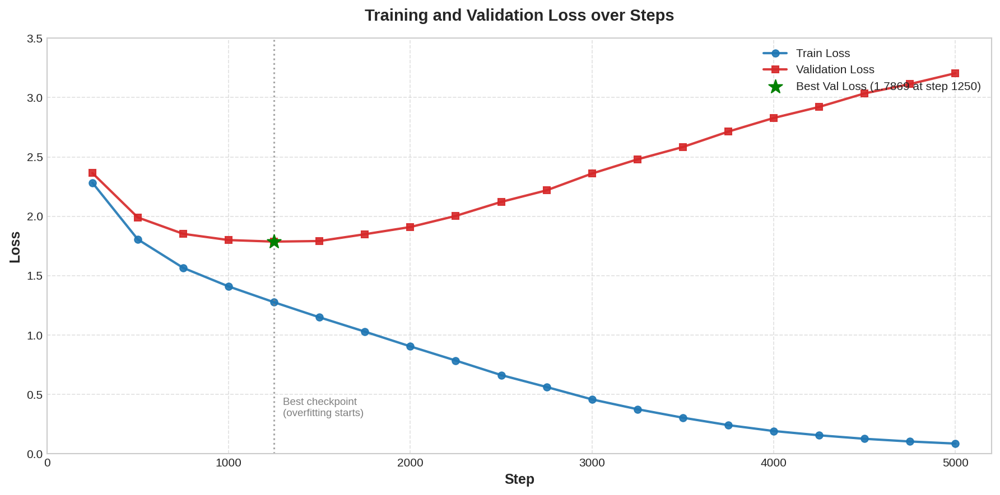

# microGPT

microGPT is a character-level GPT-style language model built from scratch using PyTorch. It learns to predict the next character in a sequence and can generate new Shakespeare-like dialogue.

The project retains the core ideas behind the decoder-only Transformer architecture ([Vaswani et al., 2017](https://arxiv.org/pdf/1706.03762)), but instead of Post-LN, it implements the Pre-LN Transformer variant ([Xiong et al., 2020](https://arxiv.org/pdf/2002.04745)).

This implementation covers only the pre-training phase and doesn't cover the fine-tuning phase.

## Model specifications
Our model largely follows the decoder-only, Pre-LayerNorm transformer. I trained a 6-layer decoder-only transformer with masked self-attention heads (384 dimensional states and 6 attention heads). For the position-wise feed-forward networks, we used 1536 dimensional inner states. We used the AdamW optimization scheme with a learning rate of 3e-4. I trained the model for 92 epochs (5000 optimizer steps) on mini-batches of size 64. Each sample was a contiguous sequence of 256 character tokens. These fixed-length sequences were shuffled before being grouped into training batches. The initial weights for token and positional embeddings were initialized from a normal distribution ([nn.Embedding](https://docs.pytorch.org/docs/2.13/generated/torch.nn.modules.sparse.Embedding.html)) and the weights for the linear layers were initialized from Kaiming uniform initialization ([nn.Linear](https://docs.pytorch.org/docs/2.13/generated/torch.nn.Linear.html)). To reduce overfitting, we used dropout with a probability of 0.2. Dropout was applied to the normalized attention weights immediately after the softmax operation in every self-attention head. It was also applied after the multi-head attention output projection and after the final linear layer of each feed-forward network, before their outputs were added to the residual stream. No dropout was applied to the token or positional embeddings. Dropout was enabled during training and disabled during validation and text generation. In layer norm, scales are initialized to 1 and biases to 0. I used a simple index to character tokenizer. For the activation function, I used the Gaussian Error Linear Unit (GELU). The model was trained on AWS EC2 (g4dn.xlarge) instance with a single NVIDIA Tesla T4 GPU.

| Setting | Value |
|---|---:|
| Parameters | 10.8 million |
| Transformer layers | 6 |
| Attention heads | 6 |
| Embedding size | 384 |
| Context length | 256 |
| Batch size | 64 |
| Learning rate | 3e-4 |
| Optimizer | AdamW |
| Evaluation interval | 250 steps |

<!-- ## Training results  (Without Dropout)

| Step | Training loss | Validation loss |
|---:|---:|---:|
| 250 | 2.2555 | 2.3384 |
| 500 | 1.7388 | 1.9803 |
| 750 | 1.4719 | **1.8791** |
| 1000 | 1.2597 | 1.9290 |
| 1250 | 1.0194 | 2.1345 |

The training was originally planned for 5000 optimizer steps, but I stopped the training after 1250 steps as the training loss continued falling while the validation loss increased, indicating overfitting. The best validation result occurred at step 750. Model checkpointing preserved the step-750 model. -->

## Training results

| Step | Training loss | Validation loss |
|---:|---:|---:|
| 250 | 2.2831 | 2.3641 |
| 500 | 1.8057 | 1.9904 |
| 750 | 1.5658 | 1.8524 |
| 1000 | 1.4094 | 1.7999 |
| 1250 | 1.2765 | **1.7869** |
| 1500 | 1.1495 | 1.7919 |
| 1750 | 1.0288 | 1.8492 |
| 2000 | 0.9048 | 1.9098 |
| 2250 | 0.7856 | 2.0034 |
| 2500 | 0.6633 | 2.1212 |
| 2750 | 0.5628 | 2.2186 |
| 3000 | 0.4584 | 2.3600 |
| 3250 | 0.3758 | 2.4793 |
| 3500 | 0.3043 | 2.5833 |
| 3750 | 0.2418 | 2.7131 |
| 4000 | 0.1920 | 2.8278 |
| 4250 | 0.1561 | 2.9209 |
| 4500 | 0.1266 | 3.0347 |
| 4750 | 0.1039 | 3.1135 |
| 5000 | 0.0863 | 3.2048 |

The lowest validation loss was **1.7869 at step 1250**, and checkpointing preserved this version of the model. After step 1250, the training loss continued to decrease while the validation loss increased, indicating overfitting. Model checkpointing preserved the step-1250 model.

<!-- Although dropout delayed the onset of overfitting compared with the previous training run, continued training beyond the best checkpoint did not improve validation performance. -->



## Getting started

You need Python and PyTorch installed.

```bash
git clone https://github.com/shanthan5589/microGPT.git
cd microGPT
python -m pip install torch
```

Train the model:

```bash
python train.py
```

Training uses CUDA when it is available, otherwise it runs on the CPU. When it finishes, it writes a `model.pt` checkpoint to the project directory.

Generate text from the trained model:

```bash
python sample.py
```

You can change the prompt, max output tokens, and temperature in `sample.py`:

```python
text = " "
max_tokens = 100
temperature = 1.0
```

<!-- ## How it works

The tokenizer maps every unique character in `input.txt` to an integer. The dataset turns the resulting sequence into fixed-length input and target windows, where each target is the input shifted forward by one character.

The model learns to predict the next character using:

- learned token and position embeddings
- masked multi-head self-attention
- feed-forward layers with residual connections
- a final linear layer over the character vocabulary

During generation, the model repeatedly samples one character from its predicted probability distribution and appends it to the prompt. -->

## Project structure

| File | Purpose |
| --- | --- |
| `model.py` | Transformer model |
| `data.py` | Character tokenizer, dataset, and data loader |
| `train.py` | Training loop and checkpoint creation |
| `sample.py` | Text generation from a trained checkpoint |
| `input.txt` | Training corpus |

## Configuration

Model and training settings are kept at the top of `train.py`.

```python
context_length = 8
embed_dim = 32
n_layers = 4
num_heads = 4

epochs = 1
learning_rate = 1e-3
batch_size = 4
```

To train on your own text, replace contents of `input.txt` with your text and run `train.py` again. Prompts passed to the sampler may only contain characters that appeared in the training corpus.